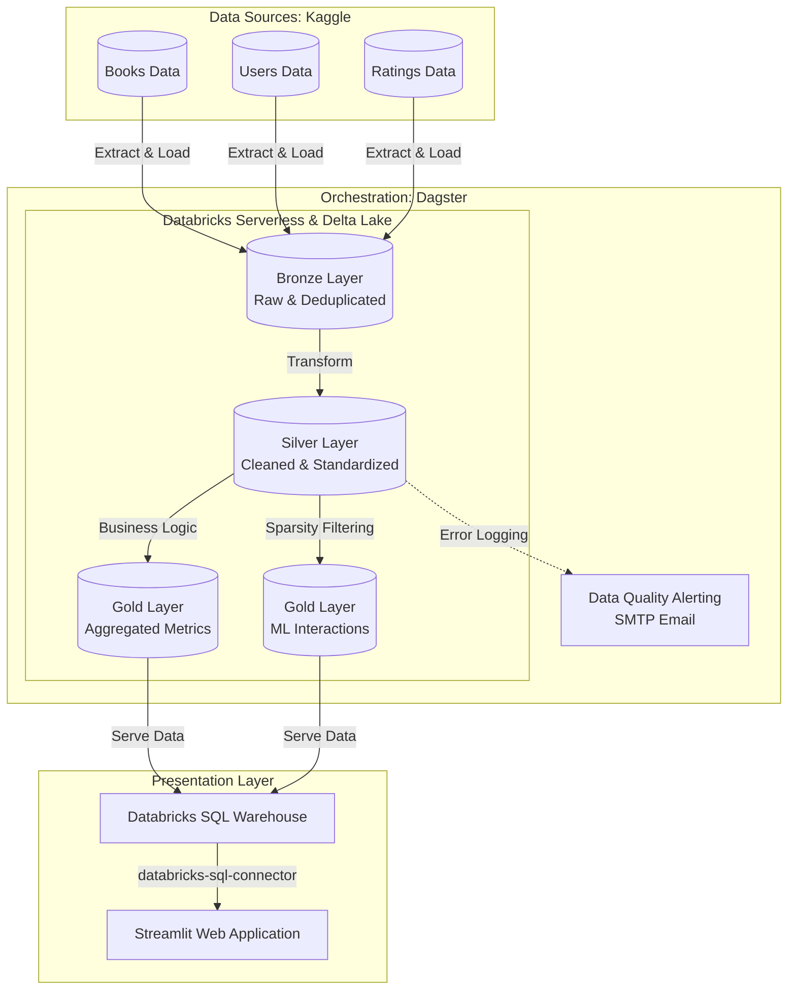

# Book Recommendation System: End-to-End Data Pipeline

## Overview
This repository contains the source code for a scalable, end-to-end data pipeline and machine learning recommendation application. Built strictly upon the **Medallion Architecture** (Bronze, Silver, Gold), the system ingests, cleans, and transforms raw book and user interaction data to serve personalized recommendations via a responsive web interface. 

The pipeline leverages modern data engineering practices, ensuring data quality, fault tolerance, and high performance.

## Architecture Diagram



## Tech Stack
* **Orchestration:** Dagster
* **Compute Engine:** Databricks Serverless (Apache Spark)
* **Storage Format:** Delta Lake
* **Frontend/Application:** Streamlit
* **Language:** Python, PySpark, SQL
* **Notifications:** SMTP Email Alerts

## Medallion Data Pipeline Setup

### 1. Landing Zone (Raw Data Storage)
* **Goal:** Act as the initial staging area for raw data before it is ingested into the Medallion architecture.
* **Data Source:** **Kaggle** (Book Recommendation Dataset).
* **Process:** The raw dataset – encompassing `Books Data`, `Users Data`, and `Ratings Data` – is manually downloaded from Kaggle and placed into this initial storage layer. 
* **Integration:** This zone serves as the starting point for the pipeline. Dagster orchestrates the pipeline by reading these raw files from the Landing Zone and loading them directly into the Databricks Bronze Layer.
* 
### 2. Bronze Layer (Raw & Staged)
* **Goal:** Create a reliable, immutable historical record of the raw data.
* **Process:** Data is read from the landing zone, schema types are explicitly cast (e.g., ensuring User-ID is a `LongType` and ISBN is a `StringType`), and primary key deduplication is applied to prevent downstream Delta merge failures.
* **Operation:** Safely upserted into the `staged_library` catalog.

### 3. Silver Layer (Cleaned & Standardized)
* **Goal:** Provide clean, filtered, and augmented data ready for analytical usage.
* **Process:** Handles missing values, enforces formatting rules, and removes invalid records.
* **Data Quality:** Integrated with Dagster Asset Sensors. If invalid records are detected during the Silver materialization process, an automated email alert is dispatched to administrators detailing the error count and asset name.

### 4. Gold Layer (Business-Level Aggregates)
* **Goal:** Deliver highly refined data optimized for machine learning, BI presentation, and dynamic querying.
* **Outputs:**
    * **`gold_book_metrics`:** Aggregated statistics per book (average rating, total reviews). Filters out books with insufficient reviews (e.g., < 5 total ratings) to ensure statistical relevance.
    * **`gold_user_item_interactions`:** The core dataset for the Collaborative Filtering model. Reduces sparsity by filtering for active users (>= 5 ratings) and popular books (>= 10 ratings).
* **Data Serving:** The Gold layer tables are stored persistently in Databricks Delta Lake and served via **Databricks SQL Warehouse**. The Streamlit web application connects directly to this warehouse using the `databricks-sql-connector` to query and fetch data dynamically, completely eliminating the need for local CSV exports and ensuring the frontend always displays the most up-to-date processed metrics.

## Application Interface
The frontend is built using **Streamlit**, providing an interactive user interface where users can:
1. Browse top-rated books based on the analytical Gold metrics.
2. Receive personalized book recommendations powered by the processed user-item interaction matrix.

## Getting Started

### Prerequisites
* Python 3.9+
* Databricks Workspace (Serverless SQL/Compute enabled)
* Dagster Environment
* Environment Variables configured for SMTP (`EMAIL_USER`, `EMAIL_PASSWORD`)

### Running the Pipeline
1. Clone the repository and install dependencies:
   ```bash
   pip install -r requirements.txt
   ```
2. Start the Dagster UI to orchestrate the pipeline:
   ```bash
   dagster dev
   ```
3. Materialize the assets from the Dagster UI. The data will flow from Landing -> Bronze -> Silver -> Gold, eventually exporting the `.csv` files to the local `data/gold/` directory.

### Running the Application
Once the pipeline has successfully materialized the Gold layer, launch the recommendation UI:
```bash
streamlit run src/app.py
```
